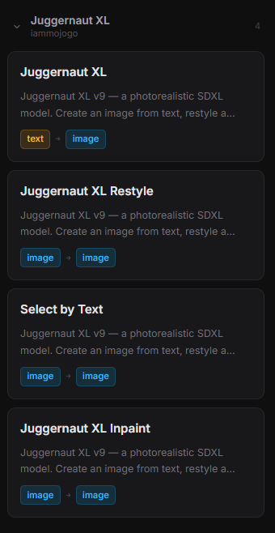
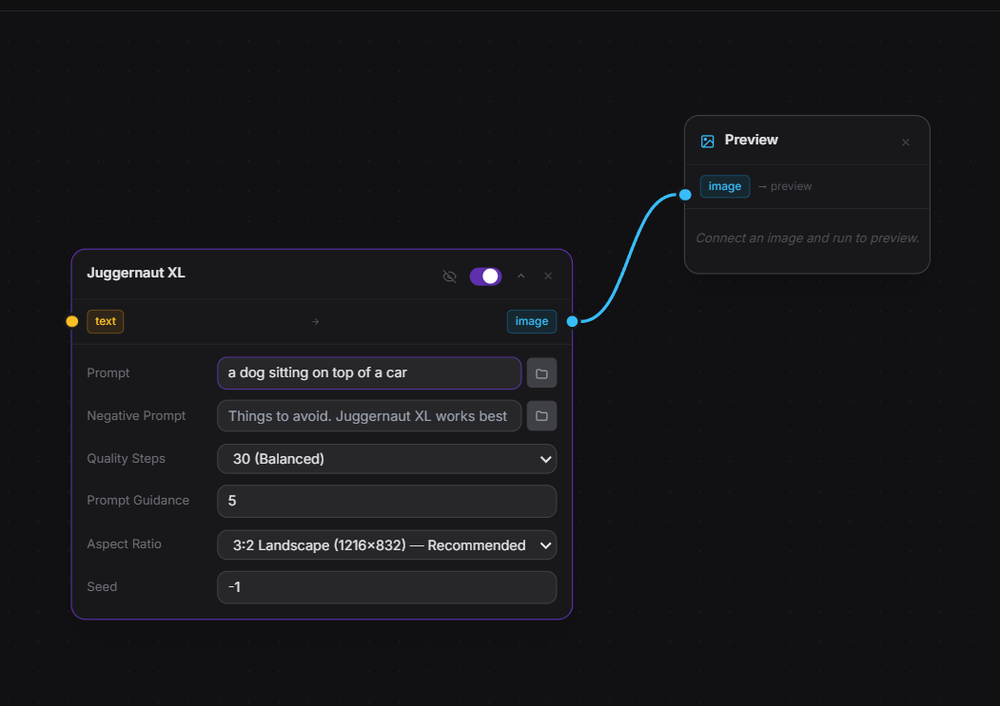
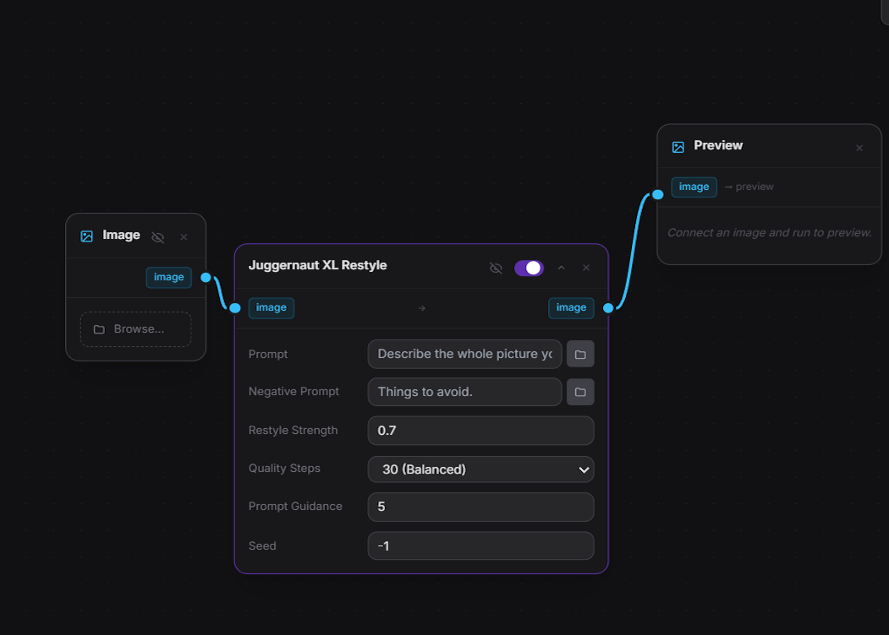
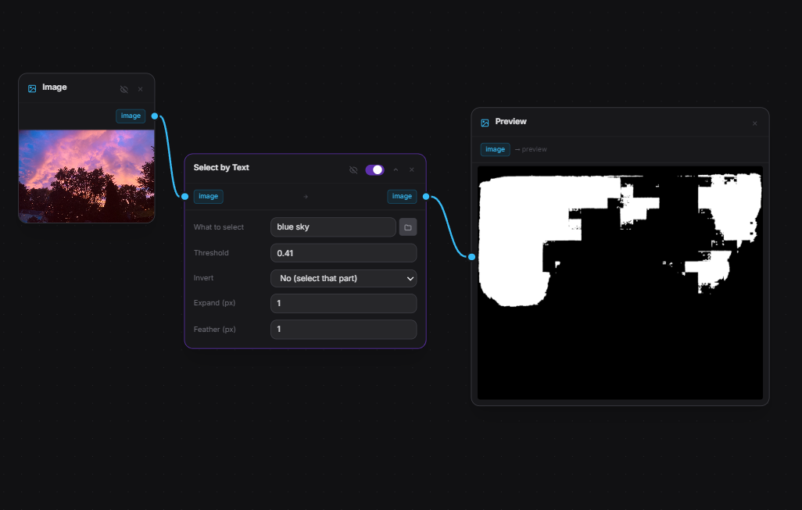
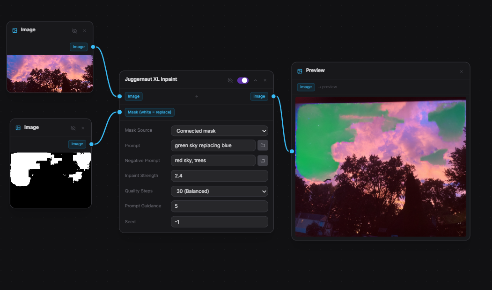
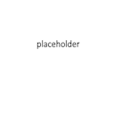

# Juggernaut XL for Modly

This extension adds image-making nodes to Modly. The model makes **realistic
photos** from plain text.

You do not need to know anything about AI. Pick a node, type what you want, press
run.

---

## The 4 nodes this extension adds

| Node | What it does in one line | Do I connect anything? |
| --- | --- | --- |
| **Juggernaut XL** | Makes a brand new image from words | No |
| **Juggernaut XL Restyle** | Redraws a **whole** image in a new style | Yes: image in |
| **Select by Text** | Picks out a part (like the sky) by typing its name | Yes: image in |
| **Juggernaut XL Inpaint** | Replaces **only** the white part of a mask | Yes: image + mask |

The three Juggernaut nodes share **one** model download. **Select by Text** needs
one small extra model.

> **Note about Preview:** the **Preview** node is **not part of this extension**.
> It is a built-in **base node** that comes with Modly, and you find it under
> **Base** in the node list — not under "Juggernaut XL". You do not download it
> from this extension, and it is not listed on the extension's page. See
> [Node 5 — Preview](#node-5--preview-see-the-picture-in-modly) below.



---

## Install (do this once)

1. Open Modly.
2. Click **Extensions**.
3. Click **Install from GitHub**.
4. Paste this link and confirm:
   `https://github.com/iammojogo-sudo/juggernaut-xl_modly`
5. Wait for setup to finish. Do not close Modly while it runs.
6. Go to the **Models** page.
7. Download **Juggernaut XL**.
   - Want to select parts by typing words? Also download **Select by Text**.
8. Wait until it says **Installed**.

**About the popup:** at the end of setup Windows asks for permission (a blue
prompt that says Python / Unknown publisher). Click **Yes**. Then **fully close
Modly**. This is only to add the **Preview** node (a Modly base node, see Node 5)
to your Modly install — it is not part of the extension itself. Modly reopens by
itself when it is done.

- Clicked **No** by mistake? Close Modly, then double-click `add_preview.bat` in
  this extension's folder.
- Want the Preview node gone? Close Modly, then run `remove_preview.bat`.

---

## What you need

- A computer with an NVIDIA graphics card (recommended).
- **6 GB** of video memory minimum. **8 GB or more** is much better.
- Some free disk space for the models.
- Mac works too, but it is slower.

---

## Node 1 — Juggernaut XL (make a picture from words)

Use this when you have **no picture** and just want one.



### Steps

1. Add the **Juggernaut XL** node to your workflow.
2. In **Prompt**, type what you want to see. Example:
   `a golden retriever puppy sleeping on a red couch, photo`
3. Leave everything else alone the first time.
4. Press run.
5. Look at the result with a **Preview** node (see Node 5).

That's it. **You do not connect any wires to this node.**

### Every setting explained

| Setting | What it does | What to put |
| --- | --- | --- |
| **Prompt** | The description of the picture | Plain words. Name the subject, place, and lighting. |
| **Negative Prompt** | Things to keep out of the picture | **Leave it empty.** This model works better with nothing here. |
| **Quality Steps** | How long it works on the picture | `30` is fine. `20` is faster but rougher. `40–50` is slower and a bit nicer. |
| **Prompt Guidance** | How strictly it follows your words | `5`. Lower (`3–4`) = more realistic. Higher (`7+`) = stranger, more forced. |
| **Aspect Ratio** | The shape of the picture | Pick **Portrait** for people, **Landscape** for scenery, **Square** for both. |
| **Seed** | The random number for this run | `-1` = different every time. Type a number to get the **exact same** picture again. |

### When it goes wrong

- **Nothing looks like your words** → your prompt is too short. Add details like
  place, light, and camera style.
- **It crashes or runs out of memory** → use a smaller image size, or close
  other programs.
- **The picture is weird/blurry** → raise Quality Steps to `40`.

---

## Node 2 — Juggernaut XL Restyle (redraw a whole picture)

Use this when you have a picture and want it **redrawn in a different style**,
like oil painting, anime, or winter.



### Important

This node changes the **entire** picture. It **cannot** keep one part the same.
If you only want to change one area (for example the sky), stop and use
[Node 3 + Node 4](#node-4--juggernaut-xl-inpaint-change-only-one-part) instead.

### Steps

1. Add the **Juggernaut XL Restyle** node.
2. Drag a wire from your image output into this node's image input.
3. In **Prompt**, describe the **whole** picture you want back, not just the
   change. Example: `same dog, but in a snowy forest at night, cinematic photo`.
4. Set **Restyle Strength** (see below).
5. Press run.

### Restyle Strength — the one knob that matters

| Value | What happens |
| --- | --- |
| **0.3 – 0.5** | Stays close to the original. Only small changes. |
| **0.6 – 0.8** | Changes a lot but you can still tell it is the same scene. |
| **0.9 – 1.0** | Almost a brand new image. The original barely survives. |

Start at `0.7`. Too strong? Lower it. Too subtle? Raise it.

### Other settings

| Setting | What to put |
| --- | --- |
| **Prompt** | Describe the whole result you want. |
| **Negative Prompt** | Leave empty unless something keeps appearing that you hate. |
| **Quality Steps** | `30`. |
| **Prompt Guidance** | `5`. |
| **Seed** | `-1` for random. Same seed + same settings = same result. |

---

## Node 3 — Select by Text (pick a part by typing its name)

Use this when you want to grab **one thing** in the photo — the sky, the car, a
person's shirt — without painting over it by hand.



### Steps

1. Add the **Select by Text** node.
2. Connect your image to it.
3. In **What to select**, type the thing you want. Examples:
   - `sky`
   - `the bicycle`
   - `the woman's jacket`
4. Press run.
5. The output is a **black-and-white mask**:
   - **White** = the part you asked for.
   - **Black** = everything else.

**Plug that mask into the Inpaint node** (Node 4) to actually change anything.

### Every setting explained

| Setting | What it does | What to put |
| --- | --- | --- |
| **What to select** | The words that describe the target | Short and specific. `sky` beats `the part above the trees`. |
| **Threshold** | How picky the selection is | `0.5` to start. Too much selected → raise it. Not enough selected → lower it. |
| **Invert** | Flips white and black | `No` normally. `Yes` if you want to keep the thing and change everything else. |
| **Expand (px)** | Grows the white area outward | `8`. Stops thin seams around the edges. |
| **Feather (px)** | Softens the edges | `4`. Raise to `10–16` if the change has a hard visible line. |

### When it goes wrong

- **It selected the wrong thing** → be more specific: `the red car`, not `car`.
- **It selected too much** → raise **Threshold**.
- **It selected only a small piece** → lower **Threshold**, or turn **Expand** up.
- **The change has a hard edge** → raise **Feather**.

---

## Node 4 — Juggernaut XL Inpaint (change only one part)

Use this to fix or replace **just one spot** — swap the sky, remove a person,
change a shirt color — while everything else stays untouched.



### Steps

1. Add the **Juggernaut XL Inpaint** node.
2. Connect the **original picture** to the first input, labeled **Image**.
3. Connect a **black-and-white mask** to the second input, labeled
   **Mask (white = replace)**.
   - Easiest mask: use **Select by Text** (Node 3).
   - Any hand-made black-and-white PNG works too.
4. In **Prompt**, describe what should appear **inside the white area** only.
   Example: `bright orange sunset sky with clouds`.
5. Press run.

**Rule to remember: WHITE changes, BLACK stays.**

### Mask Source — what the mask comes from

| Option | Use it when |
| --- | --- |
| **Connected mask** (default) | You plugged a mask into the second input. This is the normal choice. |
| **Transparency: replace subject** | Your image has a see-through background and you want to change the **subject** area. Works with **Image Editor → Remove Background**. |
| **Transparency: replace background** | Same, but you want to change the **background**. |

Leave it on **Connected mask** unless you are using a transparent PNG.

### Every setting explained

| Setting | What it does | What to put |
| --- | --- | --- |
| **Mask Source** | Where the mask comes from | `Connected mask`. |
| **Prompt** | What goes in the white area | Describe only that spot, e.g. `wet cobblestone street`. |
| **Negative Prompt** | Things to avoid | Leave empty. |
| **Inpaint Strength** | How hard that spot is redrawn | `0.9`. Lower (`0.6–0.7`) keeps more of the old texture. |
| **Quality Steps** | Time spent on the fix | `30`. |
| **Prompt Guidance** | How strictly it follows the words | `5`. |
| **Seed** | Random number | `-1`. |

### When it goes wrong

- **Nothing changed** → your mask has no white in it, or **Mask Source** is set
  to transparency while you connected a mask.
- **The whole image changed** → white is covering everything. Fix the mask.
- **The edges show a visible seam** → go back to Node 3 and raise **Feather**
  and **Expand**.

---

## Node 5 — Preview (see the picture in Modly)

> **This one is not from this extension.** **Preview** is a **base node** that
> ships with Modly. You find it under **Base** in the node list, next to
> Modly's other built-in nodes — never under "Juggernaut XL". It is not
> downloaded, listed or managed as part of this extension.

Modly's canvas is built for 3D models, so flat pictures do not show up on it.
The **Preview** node displays your image right inside the workflow.



### Steps

1. Add the **Preview** node from **Base** in the node list.
2. Connect any image output to it (Juggernaut XL, Restyle, or Inpaint).
3. Run the workflow. The picture appears in the node.

### Notes

- It is a **base node**, so it is not listed under "Juggernaut XL" and it does
  not show up on the extension's page. It works with any image output.
- If the base **Preview** node is missing from your Modly, the extension's
  setup can add it: click **Repair** on this extension, or run
  `add_preview.bat` while Modly is closed.
- To take it back out, run `remove_preview.bat` while Modly is closed.

---

## Copy-paste recipes

### Recipe A — change only the sky

```
[Your image] ──► Select by Text ("sky") ──► mask ─┐
[Your image] ───────────────────────────────────► ├─► Inpaint ──► Preview
                                                 ┘   prompt: "red sunset sky"
```

### Recipe B — keep the subject, replace the background

1. **Select by Text** with `the person`.
2. Set **Invert** to **Yes (select everything else)**.
3. Connect image + mask to **Inpaint**.
4. Prompt for the new background, e.g. `busy city street at night`.

### Recipe C — restyle a whole picture

```
[Your image] ──► Restyle ──► Preview
```

Set **Restyle Strength** to `0.7`, prompt for the whole new look.

### Recipe D — make a picture from nothing

```
Juggernaut XL ──► Preview
```

No inputs. Just type a prompt and run.

---

## Tips

- Keep the default settings at first. They match the model's recommended values.
- Leave **Negative Prompt** empty. This model does better without long ones.
- Out of memory? Use a smaller image.
- Want the same picture again? Put the **Seed** number from the last run back in
  and change nothing else.

---

## FAQ

**Why did my restyle change everything?**
Because Restyle redraws the whole image. It cannot keep parts the same, even if
your prompt says so. Use Select by Text + Inpaint for one area.

**How do I change just one thing, like the sky?**
Select by Text → type `sky` → connect its mask to Inpaint → prompt for what you
want there. Only the white part changes.

**How do I make a mask myself?**
Any black-and-white image works: white on the part to change, black elsewhere.
Save it as a PNG and plug it into the **Mask** input.

**Why can't I say "keep everything the same"?**
Your prompt describes the whole picture. There is no way to attach words to one
spot, so that instruction does nothing.

**How do I remove a background?**
Use **Image Editor → Remove Background**. The subject stays exactly the same.

**Do I have to download the model three times?**
No. Juggernaut XL, Restyle and Inpaint share one download.

---

## Troubleshooting

| Problem | Fix |
| --- | --- |
| Still says **Install** after downloading | Reload Modly. |
| Says the weights are missing | Download them from the **Models** page. |
| Out of memory / crash | Use a smaller image, close other apps, or use a GPU with more VRAM. |
| Windows "Unknown publisher" popup | Click **Yes**, then fully close Modly so the Preview node installs. |
| The base **Preview** node is missing or vanished after a Modly update | It is a Modly base node, so updates can remove it. Click **Repair** on this extension, or run `add_preview.bat` while Modly is closed. |
| Nothing happens when I press run | Check the node has a prompt and, for the others, that the wires are connected. |

---

## Screenshots

Drop your images into `docs/images/` using these exact file names and they will
show up everywhere above:

| File | What to capture |
| --- | --- |
| `00-node-list.png` | The Juggernaut XL nodes in Modly's node list |
| `01-generate-node.png` | The Juggernaut XL node with a prompt typed in |
| `02-restyle-node.png` | The Restyle node wired to an image |
| `03-select-by-text.png` | Select by Text and the mask it produced |
| `04-inpaint-wiring.png` | Image + mask both plugged into Inpaint |
| `05-preview-node.png` | A finished picture showing inside the Preview node |

---

## Credits

- [Juggernaut XL v9](https://huggingface.co/RunDiffusion/Juggernaut-XL-v9) by RunDiffusion
- [CLIPSeg](https://huggingface.co/CIDAS/clipseg-rd64-refined) by CIDAS for text-based masking
- SDXL by Stability AI
- iammojogo

## License

MIT
